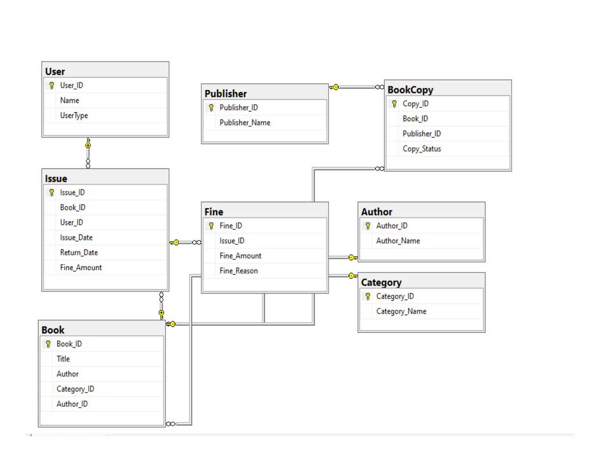

# Online Library Management System Project

## Introduction
For my project, I developed an Online Library Management System aimed at providing a user-friendly platform for issuing and managing books in a library setting. This system caters to both students and teachers, allowing them to borrow books with varying return periods and keeping track of issued books and fines incurred.

## Database Analysis and Conceptual Schemas
I began by analyzing the requirements and designing conceptual schemas for the database. This involved identifying the entities such as Books, Users (both students and teachers), Transactions, and Fines. Each entity was then mapped to its corresponding table in the database.

## Table Decomposition for Space Optimization
To optimize space and ensure efficient storage, I decomposed all tables to their minimum space-oriented forms. This involved eliminating redundant data and organizing the tables to minimize storage requirements while preserving data integrity.

## Table Relationships
I described the relationships between different tables in the database to establish referential integrity and maintain consistency in data. Relationships such as one-to-many and many-to-many were identified and implemented using appropriate foreign key constraints.

## Super Keys
I identified all super keys within the tables to ensure uniqueness and integrity of data. Super keys play a crucial role in defining primary keys and establishing entity integrity within the database.

## Constraints
I utilized various types of constraints to enforce data integrity and ensure adherence to business rules. These constraints include primary key constraints, foreign key constraints, unique constraints, and check constraints where necessary.

## Stored Procedure for Required Functions
To streamline operations and enhance functionality, I created stored procedures for the required functions within the system. These procedures facilitate tasks such as book issuance, return, fine calculation, and generating reports.

## Database Model
You can view the database model depicting the tables and their connections .
